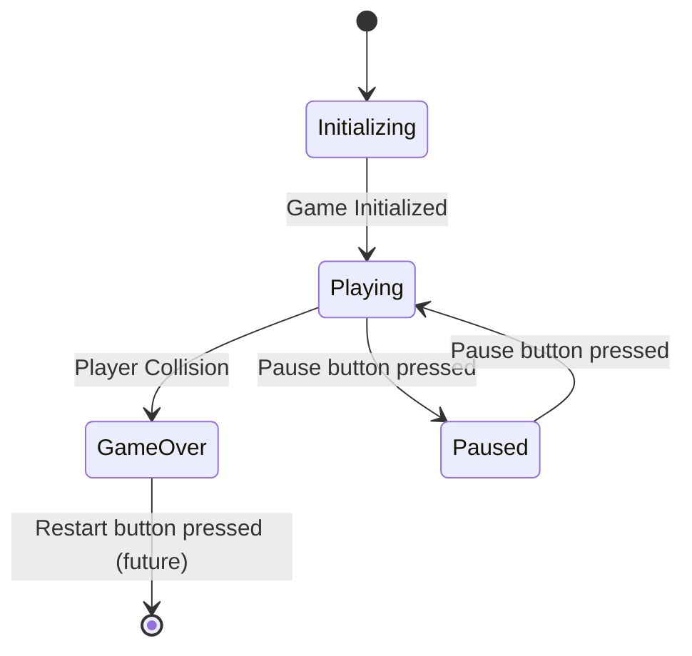

1. you storm an island and enemies come at you from all sides
2. you can click to shoot in any direction, with a ton of ammo, maybe if youre out of ammo u have to go melee range
3. you can collect wood and coins and rocks from fallen enemies
4. you can build stuff with the wood and rocks
5. you can buy new blueprints for stuff to build and upgrade for those things with coins
6. you can build your own defenses against the waves of monsters

![[create combination genre game]]

## ideas

- visually like a sketch, with paper on the unexplored features that the player is exposing, then being drawn into color and detail. creating a structure and morphing it into a new one involves an eraser, and sketching in the new shape for it then to pop into color
- structure left next to unacquired items for 1 minute becomes a "collector" saving the items for respawn inside.
	- structure next to a full collector for 1 minute become pipes, transporting what was inside the collector.
	- structure next to a pipe becomes "piped" a pipe. any pipe structures connected to it can have items flow through it from the pipe 
- hold block with right click, or special ability, or just right and left hand
- placing a structure and having it immediately eaten by a enemy 10 times grants an explosive structure to the first enemy to bite it within 1 second


# Game Design Document: "Erosion"

## **I. Introduction**

- **A. Core Philosophy/Emotional Impact:**
    - "Erasion" is designed to get the player thinking about the flow of water by sending lots of bots after them and allowing them to place walls, weapons, and buildings to direct the flow and create their own settlement amidst the constant fighting.
    - The game's simplicity and relentless enemy pressure create a feeling of being overwhelmed, but also empower the player to find moments of control through strategic obstacle placement and precision aiming.
    - The player is meant to feel like they are barely holding back an endless tide of enemies, always on the run and losing their fortifications.
    - _Prompt Suggestion:_ "Describe in detail the intended emotional response of the player when engaging with the game. How does the minimalist visual style contribute to this?"
- **B. Basic Premise:**
    - The player is a lone defender in an arena, facing an unending onslaught of geometrically pure enemies ("Erasion").
    - The player's survival depends on precise movement, strategic obstacle placement, and accurate targeting.
    - The game is a test of spatial awareness, reaction time, and resource management.
- **C. Target Audience:**
    - Players who enjoy minimalist games, challenging gameplay, and strategic survival experiences.
    - Players who appreciate a blend of retro aesthetics and modern game mechanics.

## **II. Gameplay Mechanics**

- **A. Core Gameplay Loop:**
    - Player movement (WASD/Arrow keys).
    - Enemy spawning and movement.
    - Player obstacle placement (spacebar, cooldown).
    - player obstacle upgrades(obstacles track situation around them and can morph to improve based on tracked outcomes)
    - Enemy destruction (mouse click).
    - Reward(currency + exp)
    - Reward(shop + level up)
    - weapon upgrades, shooter towers, villagers and militia
    - Collision detection (player-enemy, player-obstacle, enemy-obstacle).
    - Game over (player destruction).
    - _Prompt Suggestion:_ "Create a flow diagram illustrating the core gameplay loop. Detail the input/output of each stage."
- **B. Player Controls:**
    - Detailed description of movement controls (forward, backward, left, right).
    - Obstacle placement (spacebar, 60-second cooldown).
    - Enemy targeting and destruction (mouse click, precise coordinates).
    - Shop(p)
    - Inventory(i)
    - Skills(o)
    - (number keys) abilities and inventory
- **C. Enemy Behavior:**
    - Random spawning along arena edges.
    - Direct movement toward the player.
    - Collision detection and player destruction.
    - Movement blocked by obstacles.
    - _Prompt Suggestion:_ "Describe the algorithm for enemy spawning and movement. Provide pseudocode or a flow diagram."
- **D. Obstacle Mechanics:**
    - Impassable to both player and enemies.
    - 60-second cooldown per placement.
    - Strategic use for funneling enemies and creating defensive positions.
    - Massive potential for expansure, including placing buildings that help shoot, heal, buff, create income, boost exp, look cool
- **E. Collision Detection:**
    - Precise coordinate-based collision detection.
    - Player-enemy, player-obstacle, and enemy-obstacle interactions.
    - _Prompt Suggestion:_ "Detail the collision detection algorithm. Explain how to optimize it for performance."

## **III. Progression System**

- **A. Score System:**
    - Exp awarded for enemy destruction. Reaching Exp thresholds increases max health and mana and grants skill points.
    - Potential bonus points for consecutive kills or strategic obstacle use.
    - all game state situations are tracked by the system so that obstacles or weapons used in repeated ways will suggest improvements to further that way of doing things
	    - basic example: **walls shot with enemies near them** - bullets bounce off the wall a short distance, bullets explode in contact with the wall, bullets are returned to the player's ammo stock if they hit a wall with a zombie next to it, i ould go on. This is probably a common repeated game state when the player is not very good at aiming, so this would be a way for learners to have fun
	    - similar gamestate example: **wall rarely shot with enemies near them** - wall adds a hole to shoot through with a range or damage boost, wall boosts movement speed when nearby, wall becomes a decorative that trickles exp permanently, wall becomes a chair where the player can sit and play the harmonica
- **B. Blueprints
	- coins, wood, rock, sand, ammo, blueprints, health packs, and more dropped on enemy location at time of enemy destruction
	- coins, wood, rock, sand, ammo, blueprints can be used to create buildings
	- buildings can do many things, whatever you can imagine.
- **C. Difficulty Scaling:**
    - Increasing enemy spawn rate over time.
    - Potential introduction of new enemy types with different behaviors.
    - _Prompt Suggestion:_ "Design a difficulty scaling curve. How will enemy spawn rates and behaviors change over time?"
- **D. Potential Future Progression:**
    - Ideas for future upgrades, or unlockable player abilities.
    - Ideas for new enemy types.
    - Ideas for new arena types.

## **IV. Visual Style**

- **A. Minimalist Aesthetic:**
    - Geometric shapes (squares, triangles) for player, enemies, and obstacles.
    - Monochromatic or limited color palette.
    - Clean, uncluttered visual design.
- **B. Arena Design:**
    - 69x69 unit grid.
    - Potential for subtle visual cues or patterns within the arena.
- **C. Enemy Design:**
    - Distinct visual characteristics for different enemy types (if implemented).
    - Clear indication of enemy movement and threat level.
- **D. Visual Effects:**
    - Potential for subtle visual effects to enhance gameplay (e.g., enemy destruction animation, player damage indicator).
    - _Prompt Suggestion:_ "Create a mood board or style guide for the game's visual design. Provide examples of color palettes and geometric shapes."

## **V. Technical Implementation**

### Overall Engineering Philosophy

This would be really cool if it was as much of a webpage as it was a game. The goal is to creatively use HTML, CSS, ASCII, images, gifs, and pages to do everything in their power to reach turing completeness *before* **resorting** to a real functionally complete programming language like javascript, python, rust, java, assembly.


#### **HTML/CSS: Maximizing Usage**

**A. HTML/CSS for Visual Presentation:**
    - CSS grid/flexbox for arena layout.
    - CSS animations/transitions for basic movement and visual effects.
    - SVG for potential complex visual elements.

##### Arena and Grid:
    * We're solid on using CSS Grid to create the arena and position elements.
    * We can explore using CSS variables to define grid dimensions, allowing for easier adjustments later.

##### Player and Enemy Visuals:
    * We can get creative with CSS to style the player and enemies.
    * We can use `::before` and `::after` pseudo-elements to add details or create more complex shapes without extra HTML elements.
    * CSS transitions can handle smooth movement for basic animations like hover effects or color changes.
    
##### Obstacles:
    * CSS can entirely handle the visual representation of obstacles.
    * We can even use CSS animations to create a "placement" effect when an obstacle is created.
    
##### Basic UI:
    Simple UI elements like a score display can be created with HTML and CSS.
    We can use CSS counters or variables to update the score visually, though the actual score calculation would be in JavaScript.
    
##### Visual Feedback:
    * CSS transitions and animations can provide visual feedback for actions like enemy destruction (e.g., a quick flash or fade-out).


#### **B. JavaScript for Game Logic:**
    - Canvas API for rendering.
    - Game state management.
    - Enemy spawning and AI.
    - Collision detection.
    - Input handling.
    - _Prompt Suggestion:_ "Provide a code snippet demonstrating the core game loop in JavaScript. Explain the key functions and variables."

#### **C. Backend Considerations (Future):**
    - Potential use of backend languages (Python, Rust, Java) for complex game logic, data persistence, and networking.
    - Potential use of databases for storing player data and game statistics.
    - _Prompt Suggestion:_ "Outline the potential benefits of using a backend language for this game. Which language would be most suitable, and why?"
- **D. Performance Optimization:**
    - How to keep the game running smoothly.
    - How to handle large amounts of enemies.


**Where JavaScript is Inevitable**

* **Dynamic Positioning:**
    * While CSS can handle initial placement, any movement beyond simple transitions (like enemy movement towards the player or collision-based adjustments) will require JavaScript.
* **Game Logic:**
    * Core game logic like enemy AI, collision detection, and game state updates heavily rely on JavaScript.
* **Input Handling:**
    * Capturing and responding to player input (keyboard, mouse) necessitates JavaScript.
* **Randomness and Timing:**
    * Enemy spawning, obstacle cooldowns, and difficulty scaling involve randomness and timed events, which are best handled with JavaScript.
* **Complex Interactions:**
    * Interactions that involve dynamic element creation, modification, or removal will need JavaScript.

**Example: Pushing CSS for Enemy Destruction**

Instead of just using JavaScript to remove the enemy element, we can use CSS to visually "destroy" it:

```css
.enemy {
  /* ... */
  transition: opacity 0.5s ease-out;
}

.enemy.destroyed {
  opacity: 0;
  transform: scale(0); /* Or any other destruction effect */
}
```

JavaScript would then just add the `destroyed` class to the enemy element upon a successful click, triggering the CSS transition.

**In Summary**

We can leverage HTML and CSS to create a visually rich and interactive foundation for the game. However, the dynamic nature of the gameplay and the need for complex logic and interactions will ultimately require JavaScript. The key is to strike a balance and use each technology effectively where it shines.


### Controls
#### Input/Output Mapping

* **Mouse Position:** `duple mousePosition(x,y)` -> Update player aiming direction.
* **onClick 'mouseLeft':** -> Attempt to destroy enemy at mouse coordinates.
* **onButtonPress 'space':** -> Place obstacle in front of player (with cooldown).
* **onButtonPress 'i', 'o', 'p', 'esc':** -> Potential for future features (e.g., inventory, options, pause).

#### Visuals

#### HTML/CSS Implementation

* **Background:**
    ```html
    <div class="game-arena"></div>
    ```
    ```css
    .game-arena {
      /* ... */
      background-color: lightgray;
    }
    ```
* **Player:**
    ```html
    <div id="player"></div>
    ```
    ```css
    #player {
      /* ... */
      background-color: blue;
      border-radius: 50%;
    }
    ```
* **Enemies:**
    ```html
    <div class="enemy"></div>
    ```
    ```css
    .enemy {
      /* ... */
      border-bottom: 10px solid red; /* Or yellow, or any color */
    }
    ```

#### Input Handling (JavaScript)

* **Event Listeners:** Use `addEventListener` to capture keyboard and mouse events.
* **Mapping:** Map key codes to player actions (e.g., 'w' for forward, 's' for backward, 'space' for obstacle).
* **Mouse Position:** Track mouse position for enemy targeting.
* **Click Events:** Handle mouse clicks for enemy destruction.
### Visuals

#### Arena Layout (CSS Grid/Flexbox)

*WHite gray background (later this will be a whole procedurally generated world, with obstacles like trees, rivers, mountains) but for now its just a section or div with background:grey

* **CSS Grid:** We'll use CSS Grid to create the 69x69 unit arena. This provides a structured layout for precise positioning of the player, enemies, and obstacles.
* **Schematic (CSS Grid):**

    ```css
    .game-arena {
      display: grid;
      grid-template-columns: repeat(69, 10px); /* 10px per unit */
      grid-template-rows: repeat(69, 10px);
      width: 690px;
      height: 690px;
      background-color: lightgray; /* White-gray background */
      border: 1px solid darkgray; /* Optional border */
    }
    ```
* **Flexbox:** Alternatively, Flexbox can be used for more dynamic positioning, especially if we want to adjust the arena size or element spacing later.

#### Player and Enemy Representation (HTML/CSS)

*player is just a blue circle or a square with a circle for a head. enemies are triangles that are red or yellow or whatever*

* **HTML:**
    ```html
    <div class="game-arena">
      <div id="player"></div>
      <div class="enemy"></div> 
      <div class="enemy"></div> 
      </div>
    ```
* **CSS:**
    ```css
    #player {
      width: 10px;
      height: 10px;
      background-color: blue;
      border-radius: 50%; /* Circle shape */
      position: absolute; /* Allow movement within the arena */
    }

    .enemy {
      width: 0;
      height: 0;
      border-left: 5px solid transparent;
      border-right: 5px solid transparent;
      border-bottom: 10px solid red; /* Triangle shape */
      position: absolute;
    }
    ```
* **SVG (Potential):** For more complex shapes or animations, we can use SVG elements and style them with CSS.

#### Visual Effects (CSS Animations/Transitions)

* **CSS Transitions:** Use `transition` properties for smooth movement of the player and enemies.
    ```css
    #player {
      /* ... */
      transition: left 0.1s linear, top 0.1s linear;
    }
    ```
* **CSS Animations:** Create keyframe animations for effects like enemy destruction, player damage, or obstacle placement.
    ```css
    @keyframes enemy-destruction {
      0% { opacity: 1; }
      100% { opacity: 0; transform: scale(2); }
    }

    .enemy.destroyed {
      animation: enemy-destruction 0.5s ease-out forwards;
    }
```

### Game Logic

#### Core Game Loop (JavaScript)

* **Pseudocode:**

    ```javascript
    function gameLoop() {
      // 1. Handle player input (movement, obstacle placement)
      processInput();

      // 2. Update enemy positions and AI
      updateEnemies();

      // 3. Check for collisions (player-enemy, player-obstacle, enemy-obstacle)
      handleCollisions();

      // 4. Render the game state on the canvas
      renderGame();

      // 5. Repeat the loop
      requestAnimationFrame(gameLoop);
    }

    // Initialize game state and start the loop
    initializeGame();
    gameLoop();
    ```

#### Game State Management (JavaScript)

* Use JavaScript variables and data structures (arrays, objects) to store:
    * Player position (x, y coordinates)
    * Enemy positions (array of objects with x, y coordinates)
    * Obstacle positions (array of objects with x, y coordinates)
    * Game score
    * Game state flags (e.g., game over, paused)


*State Descriptions and Code Logic:**

1.  **Initializing:**
    * **Description:** The game is loading assets, initializing variables, and setting up the initial game state.
    * **Code Logic:**
        * Create the game arena (HTML/CSS).
        * Initialize player position, enemy array, obstacle array, score, etc. (JavaScript).
        * Set up event listeners for keyboard and mouse input (JavaScript).
        * Start the game loop (JavaScript).
2.  **Playing:**
    * **Description:** The core gameplay loop is running, handling player input, enemy AI, collision detection, and rendering.
    * **Code Logic:**
        * **Input Handling:** Process player input (movement, obstacle placement, enemy targeting).
        * **Enemy AI:** Update enemy positions and behavior.
        * **Collision Detection:** Check for collisions (player-enemy, player-obstacle, enemy-obstacle).
        * **Rendering:** Render the game state on the canvas.
        * **Game State Updates:** Update score, difficulty, and other game variables.
3.  **GameOver:**
    * **Description:** The player has collided with an enemy, and the game is over.
    * **Code Logic:**
        * Stop the game loop.
        * Display a "Game Over" message or animation.
        * Potentially show the final score.
        * In the future, add a "Restart" button to transition back to the Initializing state.
4.  **Paused:**
    * **Description:** The player has paused the game.
    * **Code Logic:**
        * Pause the game loop.
        * Display a "Paused" message or overlay.
        * Disable player input.
        * Resume the game loop when the pause button is pressed again.

**Code Example (Conceptual JavaScript):**

```javascript
let gameState = "Initializing";

function gameLoop() {
  if (gameState === "Playing") {
    // ... (Input handling, enemy AI, collision detection, rendering) ...
  } else if (gameState === "GameOver") {
    // ... (Display Game Over message) ...
  } else if (gameState === "Paused") {
    // ... (Display Paused message) ...
  }

  requestAnimationFrame(gameLoop);
}

// Event listener for pause button
pauseButton.addEventListener("click", () => {
  if (gameState === "Playing") {
    gameState = "Paused";
  } else if (gameState === "Paused") {
    gameState = "Playing";
  }
});

// Collision detection (example)
if (playerCollidesWithEnemy()) {
  gameState = "GameOver";
}
```


#### Enemy Spawning and AI (JavaScript)

* **Enemy Spawning:**
    * Generate random coordinates along the edges of the arena.
    * Create new enemy objects with those coordinates.
    * Add the new enemies to the `enemies` array.

Here's a diagram illustrating how the randomized edge spawning works:
```
+-------------------+  (0,0)
|        ^         |
|        |         |
| <------+-------> |
|        |         |
|        v         |
+-------------------+  (69,69)

Legend:
- ^ : Spawn zone for top edge (0-68)
- > : Spawn zone for right edge (69-137)
- v : Spawn zone for bottom edge (138-206)
- < : Spawn zone for left edge (207-275)
```

1.  A random number between 0 and 275 is generated.
2.  This number is mapped to a specific edge and coordinate along that edge.
3.  An enemy is spawned at that coordinate.


##### Enemy AI: Enhanced Movement and Obstacle Avoidance

* **Enemy AI:**
    * Calculate the direction vector from each enemy to the player.
    * Move the enemy towards the player based on the direction vector and a speed value.
    * Implement obstacle avoidance logic (e.g., pathfinding or simple collision checks).

##### Non-Linear Movement

Instead of always moving directly towards the player, we can introduce some variation in the enemy's movement to make it less predictable. Here's one approach:

* **Influenced Randomness:**
    * Calculate the direction vector towards the player as before.
    * Add a small random offset to the `x` and `y` components of the direction vector.
    * This will make the enemy move in a slightly jittery or curved path, while still generally heading towards the player.

##### Obstacle Avoidance with Player Influence

* **Pseudocode:**

```javascript
function updateEnemyMovement(enemy) {
  // Calculate direct path towards player
  let directionX = enemy.targetX - enemy.x;
  let directionY = enemy.targetY - enemy.y;

  // Check for obstacle collision in the direct path
  if (collisionDetected(enemy.x + directionX, enemy.y + directionY)) {
    // Obstacle detected!

    // Option 1: Random movement with player influence
    let randomAngle = Math.random() * Math.PI * 2; // Random angle in radians
    let influencedX = Math.cos(randomAngle) * enemy.speed + directionX * 0.5; // Combine random direction with player influence
    let influencedY = Math.sin(randomAngle) * enemy.speed + directionY * 0.5;

    // Check if the influenced random movement is valid
    if (!collisionDetected(enemy.x + influencedX, enemy.y + influencedY)) {
      enemy.x += influencedX;
      enemy.y += influencedY;
    }

    // Option 2: Pathfinding (future implementation)
    // ... (Use A* or other pathfinding algorithm to find a path around the obstacle) ...
  } else {
    // No obstacle, move directly towards player
    enemy.x += directionX * enemy.speed;
    enemy.y += directionY * enemy.speed;
  }
}
```

* **Explanation:**
    * The code first checks if the enemy's direct path towards the player is blocked by an obstacle.
    * If blocked, it generates a random movement vector but adds a component of the direct path to it. This creates a movement that is random but still influenced by the player's position.
    * If the influenced random movement is also blocked, the enemy could try a different random direction or remain stationary until the path is clear.
    * In the future, more sophisticated pathfinding algorithms can be implemented for smarter obstacle avoidance.

This approach provides a balance between random movement and a general tendency to move towards the player, making the enemy AI less predictable while still posing a threat.


#### Collisions

> [!summary]
> * **Player-Enemy Collision:**
>     * Calculate the distance between the player's center point and each enemy's center point.
>     * If the distance is less than the sum of their radii (or a defined hitbox), a collision occurs.
> * **Player-Obstacle and Enemy-Obstacle Collision:**
>     * Check if the player's or enemy's next position overlaps with the coordinates of any obstacle.
>     * If an overlap is detected, prevent the movement.

details for the collision detection algorithm, focusing on the mouse interaction for enemy destruction and the enemy-player collision for game over, keeping in mind the visual cues primarily being basic web language and the game states first trying to use the tools available to a creative and innovate web developer but acquiescing eventually to javascript or python or rust


##### **I. Mouse Interaction (Enemy Destruction)**

- **A. Hover Detection (CSS):**
    - Each enemy is represented by an HTML element (e.g., a `div` or `canvas` element).
    - CSS `:hover` pseudo-class is applied to the enemy element.
    - When the player's mouse cursor is over the enemy element, the `:hover` style is activated.
    - This allows the player to visually identify which enemy they are targeting.
- **B. Click Detection (CSS/JavaScript):**
    - CSS `:active` pseudo-class can be used to provide visual feedback upon a click, such as a brief color change or a scaling effect.
    - To achieve the destruction of the enemy, javascript will be used.
    - Javascript will have an event listener that is activated on a mouse click.
    - The event listener will check the location of the click, and compare it to the location of the enemy.
    - If the click location is within the enemy's location, the enemy will be destroyed. This means that the enemy element will be removed from the DOM.
    - CSS animations or transitions can be triggered upon the click event to display a visual effect (e.g., a flash, a particle effect, or a brief color overlay) to indicate the enemy's destruction.
- **C. Visual Feedback:**
    - The visual effect triggered by the click should provide clear feedback to the player that the enemy has been destroyed.
    - This could be a simple color change, a particle effect, or a more elaborate animation.

##### **II. Enemy-Player Collision (Game Over)**

- **A. Coordinate-Based Collision Detection (JavaScript):**
    - The player's position and each enemy's position are tracked as coordinates (x, y).
    - In the game loop, JavaScript calculates the distance between the player's position and each enemy's position.
    - If the distance between an enemy and the player is less than a certain threshold (representing the player's "hitbox"), a collision is detected.
    - Obstacles will also have their coordinates tracked, and enemies will not be able to have their coordinates be the same as the coordinates of an obstacle.
- **B. Game Over State:**
    - Upon collision detection, the game enters a "game over" state.
    - The game loop is paused or stopped.
    - A visual effect is triggered to indicate the player's destruction (e.g., a screen flash, a fading animation, or a "game over" message).
    - after a 1 second fade away the game fades back in for 1 second, starting at turn 1 of the new game state. no "begin a new game?" screen. just into the next game.
- **C. Visual Feedback:**
    - The visual effect should clearly indicate the player's demise.
    - This could be a simple animation, a screen overlay, or a more elaborate sequence.

##### **III. Obstacle Collision**

- **A. Coordinate Based collision detection (Javascript):**
    - The same coordinate system that governs the player and enemies will also be used to govern the obstacles.
    - When the player attempts to move, or when an enemy attempts to move, the javascript will check if the new coordinates are the same coordinates as an obstacle.
    - If the new coordinates match the coordinates of an obstacle, the movement will be prevented.

**Key Considerations:**

- **Performance:**
    - Optimize collision detection calculations to minimize performance impact, especially as the number of enemies increases.
    - For the click event, only check the coordinates of the enemies that are currently on the screen.
- **Precision:**
    - Ensure accurate coordinate tracking and collision detection to provide a fair and consistent gameplay experience.
- **Visual Clarity:**
    - Provide clear visual feedback to the player upon enemy destruction and game over.
    - Make sure that obstacles are easily visually distinguished from the rest of the arena.


#### Construction
  
1) Initial Placement: When spacebar is pressed, we see the object placement range as a circle of light gray dotted radius 10 around the player. the color of that radius depends on the location of the mouse, the the mouse icon graphically depends on the hover percentage status, which basically means it will act as a preview on what you will build.
	1) hover inside the range and it will display a dashed square/cube
	2) hover outside the range and the range radius will turn red
	3) hover over another base object and 
		1) if hovering 0.1-25% over, the svg line that would describe the wall appears, opaque and dashed
		2) if hovering 26%-80%, show an opaque building
		3) if hvoering 81-90%, show an opaque tower
2) Initial Placement: when spacebar is released, the object is placed in construction phase at the location. when construction phase is done, the building goes through the visual transform.
  
  


### Backend Considerations (Future)

#### Benefits of Using a Backend

* **Complex Game Logic:** A backend language can handle more complex game logic, such as advanced AI, pathfinding, or server-side calculations.
* **Data Persistence:** A backend with a database can store player data, game statistics, and leaderboards.
* **Networking:** A backend enables multiplayer functionality, allowing players to interact in real-time.

#### Suitable Backend Languages

* **Python (with Django/Flask):** Easy to learn, versatile, and has a large ecosystem of libraries for game development and web development.
* **Rust:** High performance, memory safety, and good for computationally intensive tasks.
* **Java:** Mature language with a strong track record in game development and server-side applications.

### Performance Optimization

#### Techniques

* **Efficient Collision Detection:** Use optimized algorithms (e.g., spatial partitioning) to reduce the number of collision checks.
* **Object Pooling:** Reuse enemy objects instead of creating and destroying them constantly.
* **Throttling:** Limit the rate of certain events (e.g., enemy spawning) to prevent overwhelming the game loop.
* **Code Optimization:** Write clean and efficient JavaScript code.

#### Handling Large Numbers of Enemies

* **Spatial Partitioning:** Divide the arena into smaller sections and only check for collisions within the relevant sections.
* **Culling:** Don't render or update enemies that are off-screen.
* **Level of Detail:** Reduce the complexity of enemy rendering or AI for enemies that are far away from the player.


## **VI. Development Process**

- **A. Iterative Development:**
    - Focus on building the core gameplay loop first.
    - Gradually add features and refine the visual design.
    - Regular testing and feedback.
- **B. Version Control:**
    - Use Git for version control and collaboration.
- **C. Testing and Debugging:**
    - Thorough testing of all game mechanics.
    - Debugging tools and techniques.
- **D. Future Development:**
    - Ideas for post launch content.
    - Community involvment.

## **VII. How to Play**

- **A. Basic Instructions:**
    - Clear and concise explanation of player controls and game objectives.
    - Play your way!
- **B. Strategic Tips:**
    - Guidance on effective obstacle placement and enemy targeting.
    - Tips for surviving against increasing enemy pressure.

